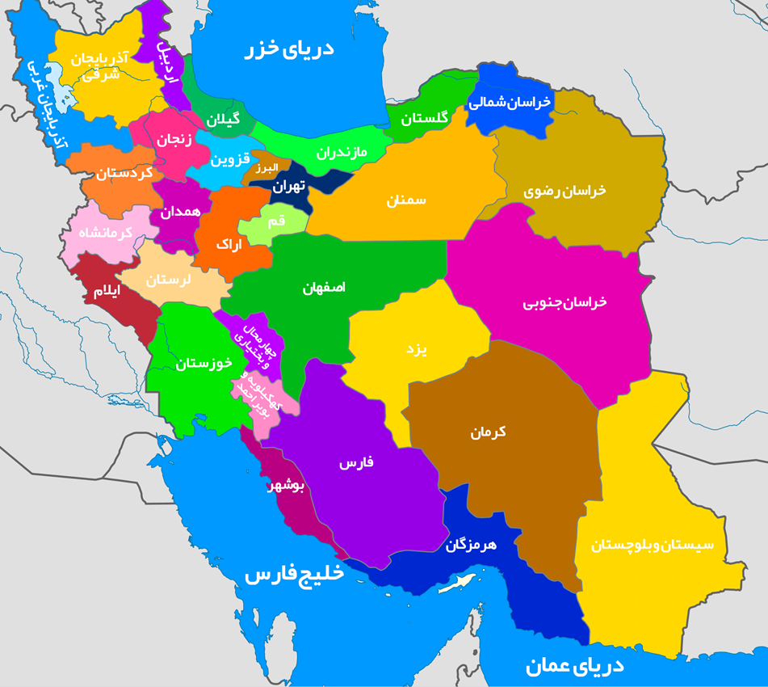

# 🗺️ نقشه گردشگری ایران (Iran Tourism Map)

  
   
  <em>نقشه تعاملی ایران - با کلیک روی هر استان به راهنمای سفر بروید</em>

 

  

## 📖 درباره پروژه

یک نقشه تعاملی و دقیق از ایران که با کلیک روی هر استان، کاربر را به صفحه راهنمای سفر و جاذبه‌های گردشگری آن در سایت **کجارو** هدایت می‌کند

## ✨ ویژگی‌ها

| ویژگی | توضیح |
|-------|-------|
| 🗺️ **نقشه دقیق و باکیفیت** | نمایش کامل تمام استان‌های ایران |
| 🖱️ **کلیک هوشمند** | تعامل سریع با هر استان برای مشاهده اطلاعات |
| 🔗 **اتصال مستقیم** | هدایت به صفحات راهنمای سفر در کجارو |
| ⚡ **کارایی بالا** | سرعت و دقت بسیار زیاد در تشخیص موقعیت استان‌ها |
| 📱 **واکنش‌گرا** | بهینه‌شده برای نمایش در موبایل و دسکتاپ |

## 🚀 نحوه استفاده

1. فایل `Html1.html` را در مرورگر خود باز کنید
2. نقشه ایران نمایش داده می‌شود
3. روی استان مورد نظر خود کلیک کنید
4. به طور خودکار به صفحه اختصاصی آن استان در سایت کجارو هدایت خواهید شد

## 🗂️ ساختار پروژه

Iran-Tourism-Map/
├── Html1.html          # صفحه اصلی نقشه
├── iran1.png           # نقشه ایران
└── README.md           # مستندات پروژه

## 🛠️ تکنولوژی‌های استفاده شده

| فناوری | کاربرد |
|--------|--------|
| **HTML5** | ساختار و چارچوب صفحه |
| **CSS3** | استایل‌بندی و طراحی واکنش‌گرا |
| **JavaScript** | منطق کلیک و هدایت کاربر |

## 📋 لیست استان‌های پشتیبانی شده

تمامی **۳۱ استان** ایران به صورت کامل پوشش داده شده‌اند:

<table align="center">
  <tr>
    <td>تهران</td>
    <td>اصفهان</td>
    <td>خراسان رضوی</td>
  </tr>
  <tr>
    <td>فارس</td>
    <td>مازندران</td>
    <td>گیلان</td>
  </tr>
  <tr>
    <td>اردبیل</td>
    <td>آذربایجان شرقی</td>
    <td>آذربایجان غربی</td>
  </tr>
  <tr>
    <td>کرمان</td>
    <td>سیستان و بلوچستان</td>
    <td>هرمزگان</td>
  </tr>
  <tr>
    <td>بوشهر</td>
    <td>خوزستان</td>
    <td>چهارمحال و بختیاری</td>
  </tr>
  <tr>
    <td>کهگیلویه و بویراحمد</td>
    <td>لرستان</td>
    <td>همدان</td>
  </tr>
  <tr>
    <td>کرمانشاه</td>
    <td>ایلام</td>
    <td>کردستان</td>
  </tr>
  <tr>
    <td>زنجان</td>
    <td>قزوین</td>
    <td>البرز</td>
  </tr>
  <tr>
    <td>قم</td>
    <td>مرکزی</td>
    <td>سمنان</td>
  </tr>
  <tr>
    <td>گلستان</td>
    <td>خراسان شمالی</td>
    <td>خراسان جنوبی</td>
  </tr>
  <tr>
    <td colspan="3" align="center">یزد</td>
  </tr>
</table>

## 🎯 دقت نقشه

این نقشه با **دقت بسیار بالا** طراحی شده است تا:

- ✅ مرزهای استانی کاملاً شفاف و مشخص باشند
- ✅ نقاط کلیک دقیقاً منطبق بر محدوده جغرافیایی هر استان باشند
- ✅ هیچ‌گونه هم‌پوشانی یا خطایی در تشخیص استان‌ها وجود نداشته باشد

## 🔧 نصب و اجرا

# کلون کردن مخزن
git clone https://github.com/amirhossein-sabouri/Iran-Tourism-Map.git

# ورود به پوشه پروژه
cd Iran-Tourism-Map

# اجرای پروژه
# فایل Html1.html را مستقیماً در مرورگر باز کنید

## 🤝 مشارکت

اگر قصد همکاری در بهبود این پروژه را دارید:

1. 🔱 مخزن را **Fork** کنید
2. 🌿 یک **Branch** جدید ایجاد کنید (`git checkout -b feature-improvement`)
3. 💾 تغییرات خود را **Commit** کنید (`git commit -m 'Add improvement'`)
4. 📤 به Branch اصلی **Push** کنید (`git push origin feature-improvement`)
5. 🔄 یک **Pull Request** ارسال کنید

## 📞 ارتباط با من

| | |
|---|---|
| **سازنده** | امیرحسین صبوری خسروشاهی |
| **ایمیل** | sabouriamirhossein9@gmail.com |
| **گیت‌هاب** | [@amirhossein-sabouri](https://github.com/amirhossein-sabouri) |

## ⭐ حمایت

**اگر از این پروژه لذت بردید، لطفاً به آن ⭐ Star بدهید!**

</a>

